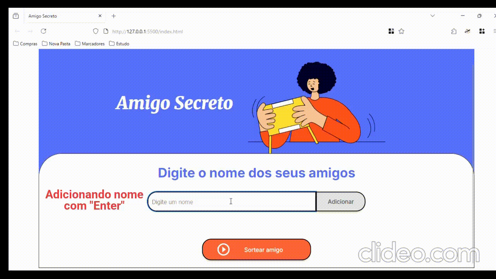

# 🎁 Amigo Secreto

Uma aplicação simples e intuitiva feita com HTML, CSS e JavaScript que permite adicionar nomes de amigos, listar participantes e sortear aleatoriamente um deles. Ideal para festas, confraternizações e eventos de fim de ano! Este é um projeto de Formação Inicial em Lógica de Programação da ONE (Oracle Next Education) e Alura.


---

## 📋 Funcionalidades

- ✅ Adição de nomes com botão ou tecla `Enter`
- ✅ Lista de amigos com primeira letra maiúscula automaticamente
- ✅ Validação de campo vazio com alerta personalizado
- ✅ Sorteio aleatório com exibição dinâmica do resultado
- ✅ Interface responsiva e visual agradável

---

## 🌐 Acesse Online

Veja o projeto funcionando:  
🔗 https://sortear-um-amigo.vercel.app/

---
✨ Como Usar
1. Acesse a barra do navegador e digite:
https://sortear-um-amigo.vercel.app/
3. Digite os nomes dos participantes um a um e pressione Enter ou clique em "Adicionar".
4. Ao final, clique em "Sortear amigo" para revelar o sorteado!
5. Para limpar lista no teclado de um "F5" ou clique em "Recarregar página"

## 🧪 Demonstração



---

## 🧠 Tecnologias Utilizadas

- **HTML5**
- **CSS3**
- **JavaScript (Vanilla JS)**

---

## 🖥️ Estrutura do Projeto

```bash
📁 challenge-amigo-secreto
├── index.html              # Página principal
├── style.css               # Estilos do projeto
├── app.js                  # Lógica do sorteio
└── assets/
    ├── amigo-secreto.png   # Imagem decorativa
    └── demo.gif            # Gravação da aplicação em funcionamento


⚙️ Validações
1. O campo de nome não pode estar vazio.
2. A primeira letra de cada nome é automaticamente identificada como Maiúscula.
3. A lista é atualizada em tempo real.
4. O sorteio só ocorre se houver ao menos um nome adicionado.

## 📥 Como baixar e executar este projeto

Siga as etapas abaixo para clonar e executar este projeto na sua máquina local:

### 1️⃣ Pré-requisitos
Antes de começar, você precisa ter instalado no seu computador:

- [Git](https://git-scm.com/downloads)
- [Node.js](https://nodejs.org/) (se o projeto usar JavaScript/Node)
- Um editor de código, como [VS Code](https://code.visualstudio.com/)

---

### 2️⃣ Clonar o repositório
Abra o terminal (ou Git Bash) e execute:
git clone https://github.com/neigit485/amigo-secreto.git

```bash
# Clonar este repositório
git clone https://neigit485.github.io/amigo-secreto

# Entrar na pasta do projeto
cd SEU-REPOSITORIO


🛠️ Autor
Desenvolvido por Valdinei Costa 💻

Sinta-se livre para usar, modificar e compartilhar! 🙌
